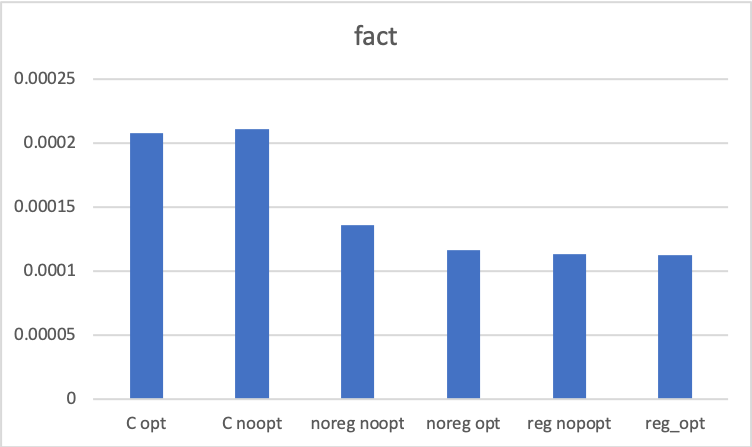

% 計算機科学実験 レポート3
% 1029-28-9483 勝田 峻太朗
% \西暦 \today

\newpage

# 課題8 (仮想機械コード生成: 必須)

> `vm.ml`の`trans`関数を完成させることにより,フラット表現から仮想機械コードへの変換を実現しなさい.

#### `vm.ml`

```{.ocaml .numberLines}
(* ==== 仮想機械コードへの変換 ==== *)

let label_of_id (i: F.id): label = i

let trans_decl (F.RecDecl (proc_name, params, body)): decl =
  (* convert function names to label *)
  let proc_name' = label_of_id proc_name in
  (* generate new id *)
  let fresh_id_count = ref 0 in
  let fresh_id () = 
    let ret = !fresh_id_count in
    fresh_id_count := ret + 1;
    ret in
  (* >>> association between F.Var and local(id)s >>> *)
  let var_alloc = ref (MyMap.empty: (F.id, id) MyMap.t) in
  let append_local_var (id: F.id) (op: id) = var_alloc := MyMap.append id op !var_alloc in
  let convert_id i = 
    match MyMap.search i !var_alloc with
    | Some x -> x
    | None -> let new_id: id = fresh_id () in
      append_local_var i new_id;
      new_id in
  let operand_of_val v = 
    match v with
    | F.Var id -> Local(convert_id id)
    | F.Fun id -> Proc(id)
    | F.IntV i -> IntV i in
  (* get number of local var (that need to be allocated) *)
  let n_local_var () = List.length(MyMap.to_list !var_alloc) in
  (* <<< association between F.Var and local(id)s <<< *)
  (* >>> remember loop >>> *)
  let loop_stack = ref ([]: (id * label) list) in
  let push_loop_stack (i, l) = loop_stack := (i, l) :: !loop_stack in
  let pop_loop_stack () = 
    match !loop_stack with
    | hd :: tl -> hd
    | [] -> (114514, "temp_label") in
  (* <<< remember loop <<< *)
  let rec trans_cexp id ce: instr list = 
    match ce with
    | F.ValExp(v) -> [Move(convert_id id, operand_of_val v)]
    | F.BinOp(op, v1, v2) -> [BinOp(convert_id id, op, operand_of_val v1, operand_of_val v2)]
    | F.AppExp(v, vl) -> [Call(convert_id id, operand_of_val v, List.map operand_of_val vl)]
    | F.IfExp(v, e1, e2) -> 
      let new_label1 = "lab" ^ string_of_int(fresh_id ()) in
      let new_label2 = "lab" ^ string_of_int(fresh_id ()) in
      let e2' = trans_exp e2 [] ~ret:id in
      let e1' = trans_exp e1 [] ~ret:id in
      [BranchIf(operand_of_val v, new_label1)] @ e2' @ [Goto(new_label2); Label(new_label1)] @ e1' @ [Label(new_label2)]
    | F.TupleExp(vl) -> [Malloc(convert_id id, List.map operand_of_val vl)]
    | F.ProjExp(v, i) -> [Read(convert_id id, operand_of_val v, i)]
  and trans_exp (e: F.exp) (accum_instr: instr list) ?(ret="default"): instr list = 
    match e with
    | F.CompExp(ce) -> 
      if ret = "default" then
        let return_id: F.id = "ret" ^ (string_of_int (fresh_id())) in
        (match ce with 
         | F.ValExp(Var id) -> accum_instr @ [Return(operand_of_val (F.Var id))]
         | _ -> let ret_assign_instr = trans_cexp return_id ce in
           accum_instr @ ret_assign_instr @ [Return(operand_of_val (F.Var return_id))])
      else let ret_assign_instr = trans_cexp ret ce in
        accum_instr @ ret_assign_instr
    | F.LetExp(id, ce, e) ->
      let instr' = accum_instr @ trans_cexp id ce in
      instr' @ trans_exp e [] ~ret 
    | F.LoopExp(id, ce, e) -> 
      let loop_label = "loop" ^ (string_of_int (fresh_id ())) in
      push_loop_stack (convert_id id, loop_label);
      trans_cexp id ce @ [Label (loop_label)] @ trans_exp e [] ~ret:"default"
    | F.RecurExp(v) -> 
      let (id, loop_lab) = pop_loop_stack () in
      [Move(id, operand_of_val v); Goto(loop_lab)]
  in ProcDecl(proc_name', n_local_var (), trans_exp body [] ~ret:"default")

(* entry point *)
let trans = List.map trans_decl
```

## 補助的な値,関数

`var_alloc: (F.id, id) MyMap.t`
: 平滑化後の`id`と,`Vm.id`の関係を保持する. 変換後のこのMapの長さが,必要なlocal変数の数となる.

`convert_id: F.id -> id`
: `id`の変換を行う. `var_alloc`にすでに変換が存在すればそれを返し,
なければ,新しい`id`を生成し,`var_alloc`に記録する.

`operand_of_val: F.value -> operand`
: 値の変換を行う.

`loop_stack`
: 現在どのloop文にいるかを保持する.
\
`trans_cexp: F.id -> F.cexp -> instr list`
: cexpの変換を行う.  `F.cexp`を`F.id`に代入するような命令列を生成する.

## `Vm.exp`への変換

変換は,`trans_exp`で行う.

### 引数

`e: F.exp`
: 変換対象の`F.exp`

`accum_instr: inst\subsur list`
: `toplevel`に来る表現を持ち回るための引数.
[]
`ret: F.id`
: 変換後の表現が返り値となる場合,`"default"`が入れられ,
変換後の表現があるid`が代入される場合はそのidが入力される.

### `F.CompExp`の変換

`trans_exp`に`F.CompExp(cexp)`が入力されたとき

1. `ret="default"`であったとき

    `Return`を通じて,`cexp`が返り値となる.

2. `ret="some_id"`であったとき,

    `trans_cexp`を用いて,`cexp`を`some_id`に代入する 命令列を生成する.

# 課題9 (必須: ARMコード生成)

> `arm_noreg.ml`の`codegen`関数を完成させることにより, 仮想機械コードからARMアセンブリコードを生成しなさい.

## 実装の方針

`gen_decl`において,各Vm.ProcDeclを受け取り,ARMコードに変換していく.
`gen_decl`の内部では,各`Vm.instr`に対して順番に変換を施して行く.
最後に変換後の命令の最初と最後に,呼び出し規約に従った適切な命令を追加し,返す.

`arm_stmts: Arm_spec.stmt list ref`
: `gen_decl`の内部で,生成した命令をここに順番に追加していく.

`stmt_instr: V.instr -> unit`
: `Vm.instr`を受け取り,`arm_stmts`に適切な命令を追加する.

手順としては,以下の用に処理する.

```ocaml
 (* convert main instrs (store to arm_stmts) *)
  List.iter stmt_instr instrs;
  [ Dir(D_align 2); Dir(D_global name);
    Label name;
  ] @
  [(* step3: save fp *)
    Instr(Str(Fp, RI(Sp, -4)));
    (* step4: save lr *)
    Instr(Str(Lr, RI(Sp, -8)));
    Instr(Sub(Fp, Sp, I 4)); Instr(Sub(Sp, Sp, I ((nlocal + 4) * 4)))] @
  !arm_stmts @
  [
    Label (name ^ "_ret");
    Instr(Add(Sp, Fp, I 4)); 
    (* step8: reset return address *)
    Instr(Ldr(Lr, RI(Fp, -4)));
    (* Step10: reset fp *)
    Instr(Ldr(Fp, RI(Fp, 0)));
    Instr(Bx(Lr))
  ]
```

## 具体的な実装

呼び出し規約に関わる部分について,説明をする.

### `Vm.Call`の変換

以下のようなステップに従って行う.

1. 関数クロージャは,常に第1パラメータにあるので,それを取り出しておく.
2. 関数の引数は,常に第2パラメータにあり,それを取り出しておく.
3. `A1, A2`レジスタの値をフレームに退避し,`A1,A2`にそれぞれ1,2で取り出した関数クロージャと引数を設定する.
4. 関数ポインタを適当なレジスタにおき,そこにジャンプする.
5. 戻ってきたら,返り値は`A1`レジスタに入っている. `A1`レジスタの値を,適当なレジスタに移し,一時保存しておく.
6. `A1,A2`レジスタの値を復旧する.
7. 一時保存した返り値を,適切なフレーム条の,`local`変数に格納する.

```ocaml
    | V.Call(id, op, opl) -> 
      let f = List.hd opl in
      let x = List.hd (List.tl opl) in
      let result_r = V6 in
      let pointer_r = V4 in
      append_stmt( 
        (* step1: save A1, A2 registers to memory, set new arguments to A1, A2 registers *)
        [Instr(Str(A1, RI(Sp, 0))); Instr(Str(A2, RI(Sp, 4)));] @ (gen_operand A1 f) @ (gen_operand A2 x) @
        (* set function pointer to register r *)
        (gen_operand pointer_r op) @
        [ 
          (* step2: jump to function head *)
          Instr(Blx(pointer_r));
          (* === preprogrammed in function === *)
          (* step3: save fp *)
          (* step4: save lr *)
          (* step5: update fp ($fp <- $fp + 4) *)
          (* step6: move $sp (n+5) words down *)
          (* step7: run function *)
          (* step8: reset return address *)
          (* Step9: reset sp *)
          (* Step10: reset fp *)
          (* Step11: go back to main function *)
          (* === preprogrammed in function === *)

          (* Step12: store result *)
          Instr(Mov(result_r, R A1));
          (* Step13: reset 2 arguments *)
          Instr(Ldr(A1, RI(Sp, 0))); Instr(Ldr(A2, RI(Sp, 4)));
          (* move answer to specified local var *)
          Instr(Str(result_r, local_access id))
        ]
      );
```

### `Malloc`の変換

`Malloc`は以下の手順にしたがって行われる. `mymalloc`の呼び出し部分についてはほとんど`Call`と同じである.

1. 確保する必要がある領域の大きさを`A1`に格納する.
2. `Call`と同じように`mymalloc`を呼び出す.
3. `A1`にある結果(確保した領域の先頭へのポインタ)を適当なレジスタに一時的に避難する.
4. `A1,A2`レジスタの値を復旧する.
5. 結果を適切なフレーム上の`local`に格納する.
6. ヒープ上に保持するべき値を,順番にヒープ上にストアしていく.

```ocaml
| V.Malloc(id, opl) -> 
      let alloc_size = List.length opl in
      let r = V7 in
      let r2 = V1 in
      append_stmt(
        [ 
          Instr(Str(A1, RI(Sp, 0)));
          Instr(Str(A2, RI(Sp, 4)));
        ] @
        (gen_operand A1 (V.IntV alloc_size)) @
        [
          (* jump to function head *)
          Instr(Bl "mymalloc");
          (* Step12: store result *)
          Instr(Mov(r, R A1));
          (* Step13: reset 2 arguments *)
          Instr(Ldr(A1, RI(Sp, 0)));
          Instr(Ldr(A2, RI(Sp, 4)));
          (* move address of allocated block to specified local var *)
          Instr(Str(r, local_access id))
        ]
```

# 課題10 (必須: バックエンドの移植)

> ARMアセンブリコードではなくC言語コードへ変換するコード生成器を作成し,性能比較を行いなさい.


## 実装の方針

各`Vm.instr`を上から順番にCコードに変換していく.

### クロージャと関数の表現

クロージャは,構造体を用いて表現する. `f`は関数ポインタ(クロージャの0番目), `vars`はスコープ外変数(クロージャの1番目以降),`length`は,スコープ外変数の個数を表す整数が入る.(`length`は結局実装においては使われない.) 

ただし,スコープ外変数は配列`vars`の0番目から書き込みされず,1番目から書き込みされる. 0番目は初期化されない.
また,スコープ外変数がない場合でも,`vars`には長さ1の初期化されてない配列が割り当てられる.
これは,`Vm`でのスコープ外変数参照時のインデックス番号と統一するためである.

#### 構造体の表現

```C
typedef struct closure
{
    int (*f)(struct closure *, const int);
    int *vars;
    int length;
} closure;
```

また,関数はクロージャのポインタと引数を,受け取る形で書かれる.

#### 関数の表現の例

```C
int _b__recf00(closure *param_0, const int param_1){
int var00 = 1;
// ... 
return var110;
}
```

### 返り値の表現

プログラム全体の返り値は,`return`ではなく,`printf`で出力する.

### ラベルとgotoの表現

```
<labelname>:;
<some operation>
<some operation>
goto <labelname>;
```

のような形で,C言語のgoto文を用いて実装する.

`BranchIf`も,

```
if(var80){
goto lab10;
};
```

のように実装する.

## 具体的な変換

変換作業は,`backend.ml`に記述されており,`Vm`コードを`c_spec.ml`で定義した`funct list`に変換していく過程である.

変換おいて,`var_assoc`において`Vm.id`か`C_spec.id`への変換を保持する.

### 代入文

C言語の代入文においては,型を明示的に示さなければいけない.
このためには,代入元の変数の型を記憶して管理する必要がある.

今回扱う型は,以下の3種類である.

`int`
: 整数型

`int*`
: 配列型(クロージャでない`tuple`). `tuple_var`で記憶する.

`closure*`
: クロージャへのポインタ. `closure_var`で記憶する.

`(空文字列)`
: すでに代入先の変数が定義されている. `defined_var`で記憶する.

これを管理するために,以下の`ref`型の`Set`を用いている.

```ocaml
  let closure_var = ref (MySet.empty: id MySet.t) in
  let tuple_var = ref (MySet.empty: id MySet.t) in
  let defined_var = ref (MySet.empty: id MySet.t) in
  let id_is_closure (id: id) = MySet.member id !closure_var in
  let id_is_tuple (id: id) = MySet.member id !tuple_var in
  let id_is_defined (id:  id) = MySet.member id !defined_var in
```

#### 型の表現(`c_spec.ml`)

```ocaml
type ty = 
  | Int
  | Closure 
  | Tuple 
  | Defined

let string_of_ty = function
  | Int -> "int"
  | Closure -> "closure*"
  | Tuple -> "int*"
  | Defined -> ""
```

### クロージャと関数呼び出しの変換

クロージャの宣言は, 以下のように行い,クロージャはすべてポインタとして扱うようにする.

```C
closure var01__;
closure* var01 = &var01__;
```

また,クロージャの各メンバの値の設定は以下のようにする.

#### クロージャの設定例

```C
var01->f = _b__recf00;
var01->length = 2;
int params[2];
params[1] = var11;
var01->vars = params;
```

また,クロージャからのメンバ取り出しはアロー演算子によって行う.

#### 関数ポインタの取り出し

```C
int (*var30)(closure*, const int);
var30 = var01->f;
```

#### スコープ外変数の取り出し

```C
var40 = var01->vars[1];
```

## コマンドラインオプション

`-b`
: ARMコードではなく,C言語の生成を行う.

`-C` 
: このオプションをつけると, 生成されたCプログラムが`gcc`によってコンパイルされる. `./a.out` を実行することにより,プログラムを実行できる.

`-o filename`
: 結果を`<filename>`に書き込む.

```bash
$ ./minimlc -b -C -o sigma.c
# loop v = (1, 0) in
if v.1 < 101 then
  recur (v.1 + 1, v.1 + v.2)
else
  v.2;;
compile c program in sigma.c => success
# ^C
$./a.out
5050
```

## 性能比較

性能比較･評価は,まとめて[**課題14**](#evaluation)において行っている.


# 課題11 (任意: データフロー解析)

> 生存変数解析モジュール`live.ml`を参考に,(a) 到達可能定義解析,(b) 到達コピー解析,の中から一つ以上を実装しなさい.`cfg.ml, dfa.ml`等の依存モジュールは汎用なフレームワークとして設計してあるので,修正することなくそのまま利用できるはずである.

## 到達可能定義解析

到達可能定義解析は,プログラムの`d`行目の定義が何行目まで有効か調べるための解析である.
これにより,例えば`d'`行目以降で,ある定義が使われていない場合,その定義を削除するなどという最適化が可能になる.
到達可能定義解析は, 以下の伝達関数に従い, 不動点反復を繰り返すことで実行できる.

$$
\begin{aligned}
gen(d) &= \{d行目で新たに生成される定義の集合\} \\
kill(d) &= {d行目で消去される定義の集合} \\ のとき, \\
f_j(x) &= gen(j) \cup (X - kill(j))
\end{aligned}
$$

## 解析器の定義

```{.ocaml .numberLines caption=解析器の定義}
open Vm
open Cfg
open Dfa
module Set = MySet

(* TODO *)
let filter_vars vs =
  Set.from_list (List.filter (fun v ->
      match v with
        Param _ | Local _ -> true
      | Proc _ | IntV _ -> false
    ) (Set.to_list vs))

let transfer (entry_vars: Vm.operand Set.t) (stmt: Vm.instr): Vm.operand Set.t = 
  let gen vs =
    lub
      (filter_vars (match stmt with
             Move (dst, src) -> Set.singleton src
           | BinOp (dst, op, l, r) -> Set.from_list [l; r]
           | BranchIf (c, l) -> Set.singleton c
           | Call (dst, tgt, args) -> Set.insert tgt (Set.from_list args)
           | Return v -> Set.singleton v
           | Malloc (dst, vs) -> Set.from_list vs
           | Read (dst, v, i) -> Set.singleton v
           | _ -> Set.empty
         ))
      vs in
  let kill vs =
    match stmt with
      Move (dst, _)
    | BinOp (dst, _, _, _)
    | Call (dst, _, _)
    | Malloc (dst, _)
    | Read (dst, _, _) -> Set.remove (Local dst) vs
    | _ -> vs in
  let kill' = kill entry_vars in
  (* TODO *)
  lub (gen entry_vars) (Set.from_list(List.filter (fun x -> not (MySet.member x kill')) (MySet.to_list entry_vars)))

(* make reachability analyzer *)
let make (): Vm.operand Set.t Dfa.analysis = 
  {
    direction = FORWARD;
    transfer = transfer;
    compare = compare;
    lub = lub;
    bottom = Set.empty;
    init = Set.singleton dummy;
    to_str = string_of_vars;
  }
```

# 課題12 (任意: レジスタ機械コード生成)

> 生存変数解析モジュールによる解析結果を用いて,仮想機械コードをレジスタ機械コードに変換しなさい.`Reg.trans`関数の第1引数で指定される整数は利用可能な汎用レジスタの個数である.なるべく多くの局所変数を汎用レジスタに割り付けるよう工夫すること.

## 実装の方針

変換におけるレジスタ割付は,生存変数解析と制御フローグラフのデータを用いて行う. 具体的には,制御フローの基本ブロックを順番に生存変数を参照しながら変換していく.

変数は空いているレジスタが存在すればレジスタに優先的に割り付けられ,空いていなければフレーム上に割り付けられる. 一度設定された割付はなるべく各段階で引き継がれ,一度フレームに割り付けられた変数は,レジスタに空きができたとしても新たにレジスタに再割付されることはない. 

ただし,レジスタへの割当が必要な場合で,レジスタが満杯の場合は,レジスタに割当られている変数との割当のスワップを行う. スワップ対象となるレジスタに割り当てられている変数は,確率的に選択する.

### フレームの管理

フレームには,以下の領域を確保する必要性がある.

(@frame) 呼び出し規約に関わる `saed fp, lr, saved a1, saved a2`の領域.
(@frame) レジスタに割付しきれなかったローカル変数を置く領域.
(@frame) 関数呼び出しをするときに,呼び出し後に必要で,かつレジスタに割り当てられている変数を退避する領域.

(2)がn個, (3)がm個ある時のフレームの状態が[**図1**](#frame_usage)となる用に実装した.

{#frame_usage height=50%}

`offset`型の変数へのアクセスは,用意されている`Load, Store`命令で行うが,レジスタ退避領域へのアクセスは,
簡単のため,新たに命令`Save, Restore: (reg*offset) -> instr`を追加した.
たとえば`Save r (m-2)` は,[**図1**](#frame_usage)の`レジスタ退避m-2`に当たる箇所へのストアを行い,`Restore`はロードを行う.

## プログラムの構造

### `trans_decl`

`Vm.decl`を`decl`に変換する. これは,生存変数解析の結果と基本ブロックを参照しながら実行する. 変換の主要な操作は,各基本ブロックに対して呼び出される`process_block`(下で[説明](#process_block))において行われる. 

#### 生存変数解析関係

`live_bblock`
: 生存変数解析によって得られた基本ブロックの配列.

`get_property`
: 命令と`Cfg.side`を受け取り,その時点での生存変数を得るための関数.

#### 生成命令関係

基本方針として,各`Vm.decl`の変換過程で生じた命令は,順番に`ref list`に追加していく.

`instrs_list`
: 生成された命令を順番に追加していくための`ref instr list`型の変数.

`append_instr`
: 命令を追加する

#### フレームに逃がす変数の量を管理

レジスタに割り当てられず,フレームに逃がす変数分の領域を計算する必要がある.

`save_space`
: 別関数への呼び出しをする際にフレームに退避する必要のあるレジスタ変数の合計を出す.

`update_savespace:  int -> unit`
: ある関数内で複数の関数呼び出しをする場合,退避するレジスタの個数の最大値をフレームに退避領域として確保する必要がある. この関数は,受け取った値(ある関数呼び出し前に対比する必要のあるレジスタの個数)が現在の`save_space`より小さければ,`save_space`の値を更新する.

```{.ocaml .numberLines}
(* manage local memory space *)
  let save_space = ref 0 in
  let update_save_space n = 
    if !save_space < n then save_space := n;
    debug_string ("updated save_space to " ^ string_of_int n )
  in
```

#### 基本ブロックごとのレジスタ割当の管理

[**図2**](#allocation_graph)は.以下のコードの実行時の生存変数解析の結果の例である.

{#allocation_graph}

```{.ocaml}
loop v = (1, 0) in
if v.1 < 101 then
  recur (v.1 + 1, v.1 + v.2)
else
  v.2;;
```

このとき,`loop3`の基本ブロック`A`から出ている2つのブロック`B`と`C`についてVMコードでは,`A -> B -> C`の順番であるが,単純にこの順番で前に述べたように実装すれば,Cに処理が到達したときに,最初の生存変数である`t4`の割付が受け継がれない. これを防ぐためには, 基本ブロック`A`
の割当情報を保存しておき,`C`に到達したときにロードする必要がある.

これを実現するために,各ブロックに対して,ブロック最後の命令におけるレジスタ割当情報を保持しておく仕組みを作る.

`past_allocations: (V.id, dest) MyMap.t array ref`
: `i`番目のブロック末尾の割付情報を配列の`i`番目に保存する.
初期値は空データである.

`set_past_alloc`
: 割付情報をi番目に保存する.

`get_past_alloc`
: i番目のブロックの割付情報を取得する.

```{.ocaml .numberLines}
  (* save allocations in other blocks *)
  let past_allocations = ref (Array.make (Array.length live_bblock) MyMap.empty: (V.id, dest) MyMap.t array) in
  let set_past_alloc alloc i = 
    Array.set !past_allocations i alloc in
  let get_past_alloc i = 
    Array.get !past_allocations i in
```

#### オフセットの管理

レジスタに割付しきれなかった変数は`offset`型として,フレーム内に割付される. この`offset`型の個数を管理する必要がある.

`offset_counter`
: 現在の`offset`型の個数を保持する.初期値0に設定してある.

`get_new_offset`
: 新しい`offset`のインデックスを返し,`offset_counter`を更新する.

```{.ocaml}
(* manage offset of local *)
  let offset_counter = ref 0 in
  let get_new_offset () = 
    let r = !offset_counter in
    offset_counter := !offset_counter + 1;
    r in
```

#### レジスタ割当の管理,更新

各命令の変換前に,その命令の前後の生存変数を参照し,レジスタ割当を決定してから値を更新する.
具体的な手順は以下.(ただし, 命令の直前の生存変数を`BEFORE`, 直後の生存変数を`AFTER`とする.)

1. `BEFORE`に入っている生存変数の割当をを前の命令評価時の割当から引き継ぐ.
2. 新しく生成される変数($S_{AFTER} \backslash S_{BEFORE}$)の割り付けを決定し,割当に追加する.

`allocation`
: 現在の変数割当を保持する.

`get_used_reg`
: 現在の変数割当のうち,使用済みのレジスタのリスト

`get_free_reg`
: 現在変数割当で使用されていないレジスタのリストを返す.

`get_nlocal`
: 現在フレームに割り当てられている変数の総数を返す.

```{.ocaml .numberLines}
 (* manage allocation of Vm.id to dest >>> *)
  let allocation = ref (MyMap.empty: (V.id, dest) MyMap.t) in
  let append_alloc (id, d) = allocation := MyMap.append id d !allocation in
  let search_alloc id = MyMap.search id !allocation in
  let string_of_alloc () = 
    String.concat ", "
      (List.sort String.compare
         (List.map (fun (id, ds) -> "(t" ^ string_of_int id  ^ ", " ^ string_of_dest ds ^ ")") 
            (MyMap.to_list !allocation))) in
  let alloc_status () = 
    let rec loop l raccum laccum =
      (match l with
       | (_, R i):: tl -> loop tl (i :: raccum) laccum
       | (_, L i):: tl -> loop tl raccum (i:: laccum)
       | [] -> (raccum, laccum)) in
    loop (MyMap.to_list !allocation) [] [] in
  let get_used_reg () = 
    let (r_usage, _) = alloc_status () in
    r_usage
  in
  let get_nlocal () = 
    let (_, l_usage) = alloc_status () in
    List.length l_usage 
  in
  let get_free_reg () = 
    let used = MySet.from_list (get_used_reg ()) in
    let all = MySet.from_list (List.init nreg (fun x -> x)) in
    MySet.to_list (MySet.diff all used) in
  (* >>> manage allocation of Vm.id to dest *)
```

#### その他 補助関数

`convert_id`
: `Vm.id`に対する`dest`を生成する. 空いているレジスタがあればそこに格納し,なければ,`get_new_offset`を用いて,,新しい`offset`型の場所に割り付ける.

```ocaml
  (* >>> manage allocation of Vm.id to dest *)
  (* helper functions for converting statements >>> *)
  let convert_id id = 
    match search_alloc id with
    | Some d -> d
    | None -> 
      let free_reg = get_free_reg () in
      if List.length free_reg = 0 
      then let ret = get_new_offset () in
        (append_alloc (id, L ret);
         L ret)
      else let ret =  List.hd free_reg in
        (append_alloc (id, R ret);
         R ret)
  in
```

`convert_op`
: `Vm.operand`型を`operand`型へ変換する. `Vm.Local`型の場合は,

1. すでにレジスタに割り付けてあれば,そのレジスタを返す.
2. すでに`offset`型に割り付けてあれば,以下で説明する swap に従って割付のスワッピングを行う.
3. 割り付けられていない場合で,レジスタが空いている場合は,新たにレジスタに割りつける.
4. 割り付けられていない場合で,レジスタが空いていない場合は,スワッピングによってレジスタに割り付ける.

```ocaml
  let convert_op op = 
    match op with
    | V.Param i -> Param i
    | V.Local id -> 
      let dest = (convert_id id) in
      (match dest with
       | R i -> Reg i
       | L o -> 
         (* swap offset with some register *)
         let swap_r = select_random (get_used_reg ()) in
         swap o swap_r;
         Reg swap_r)
    | V.Proc l -> Proc l
    | V.IntV i -> IntV i
  in
```

`move_to_reg`
: レジスタにある値を`Vm.operand`に移動する命令列を生成する.

`mode_to_dest`
: レジスタにある値を`dest`型の場所に移動する命令列を生成する.

```ocaml
(* move data in s to register d *)
  let move_to_reg (d: reg) (s: V.operand): instr list =
    match s with
    | V.Param i -> [Move(d, convert_op s)]
    | V.Local id -> 
      let dest = convert_id id in
      if is_register dest 
      then [Move(d, Reg (reg_of_dest dest))]
      else [Load(d, offset_of_dest dest)]
    | V.Proc l -> [Move(d, Proc l)]
    | V.IntV i -> [Move(d, IntV i)]
  in
  (* move data in register to dest (either reg or offset) *)
  let move_to_dest (d:dest) (s:reg) = 
    match d with
    | R r -> [Move(r, Reg s)]
    | L o -> [Store(s, o)]
  in
```

### `process_block` {#process_block}

この関数は,`Cfg.bblock`と自身の`live_bblock`の配列におけるインデックスを受け取り, 変換命令を生成する(`instrs_list`に追加する).

#### 手順

1. `bblock.label`があれば,現在変換している関数のポインタやトップレベル出ない場合, `Label`型の命令を追加する.
2. `bblock.pred`があれば,その基本ブロック変換の最後の変数割付データを得て,変数割付を初期化する. 複数あれば,それを統合する.
3. その後,各命令`bblock.stmts`について,命令1つについて変数割付を更新しながら,変換する.
4. 最後の命令が変換し終わったら.その時点での変数割付データを`past_allocations`に追加する.

#### 関数呼び出し(`Call`) の変換におけるレジスタ退避

関数呼び出し時には,関数呼び出し後にレジスタに割り当てられている値が失われないように,フレーム内に退避する必要がある.
退避するのは,呼び出し命令実行後の生存変数のうち,レジスタに割り当てられいるものである.
また,呼び出し後には,退避した値をレストアする必要がある. 下のコードでは,`regs_to_save`で,退避する必要のあるレジスタを探し出し,
各レジスタに対し,`Save`と`Restore`を呼び出し前と後に行っている.

```ocaml
 | V.Call(id, op, opl) as ins ->
        (* list of live operands after call *)
        let live_ops_after = MySet.to_list (get_property ins Cfg.AFTER) in
        let rec loop ops accum = 
          match ops with
          | (V.Local id'):: tl -> 
            if id <> id' then
              (match search_alloc id' with
               | Some (R x) -> loop tl (x::accum)
               | _ -> loop tl accum)
            else loop tl accum
          | _:: tl -> loop tl accum
          | [] -> accum
        in 
        let regs_to_save = loop live_ops_after [] in
        update_save_space (List.length regs_to_save);
        append_instr(List.mapi (fun i r -> Save(r, i)) regs_to_save);
        append_instr [Call(convert_id id, convert_op op, List.map convert_op opl)];
        append_instr(List.mapi (fun i r -> Restore(r, i)) regs_to_save);
```

### 機能: スワップ

変数を新たにレジスタに割り付ける必要があり,レジスタが満杯の場合は,
確率的にレジスタを選び,スワッピングを行う.

具体的なステップは以下.

1. レジスタ割当のデータを交換する.
2. 置換対象のフレーム上のデータを予約レジスタ(Ip)にロードする.
3. 置換対象のレジスタのデータを置換対象のフレーム上にストアする.
4. 予約レジスタの値を置換対象のレジスタに移動する.

```{.ocaml .numberLines}
(* swap allocation for given offset and dest *)
  let swap (off: offset) (r: reg) =
    (* === swap alloc data === *)
    let id_off' = MyMap.reverse_search (L off) !allocation in
    let id_reg' = MyMap.reverse_search (R r) !allocation in
    let (id_off, id_reg) = 
      match (id_off', id_reg') with
      | Some o, Some r -> (o, r)
      | _ -> err "failed to swap" in
    allocation := MyMap.assoc id_off (R r) !allocation;
    allocation := MyMap.assoc id_reg (L off) !allocation;
    (* === change data === *)
    (* move offset to reserved_reg *)
    append_instr [Load(reserved_reg, off)];
    (* move reg to offset *)
    append_instr [Store(r, off)];
    (* move reserved_reg to reg *)
    append_instr [Move(r, Reg reserved_reg)];
```

\newpage

# 課題13 (任意: ARMコード生成 その2)

> `arm_reg.ml`の`codegen`関数を完成させることにより,課題12で生成したレジスタ機械コードからARMアセンブリコードを生成しなさい.

## 実装の方針

前に実装した`arm_noreg.ml`を参考に,実装を行った.

## プログラムの構造

### 補助的な関数, 値

`normal_regs`
: 汎用レジスタ`V1`~`V7`までのリスト

`param_to_reg`
: パラメータ番号をレジスタに変換する.

`reg_of_operand`
: オペランドをレジスタに変換する.

`gen_dest`
: レジスタと`Reg.dest`を受け取り,レジスタの値を`Reg.dest`に格納する命令列を生成する.

`convert_op`
: `Reg.operand`を`Arm_spec.addr`に変換する.

```{.ocaml .numberLines}
let normal_regs = List.filter (fun r -> r <> Ip) (List.map (fun (_, r) -> r) reg_mappings)

let reg_of r = List.assoc r reg_mappings

(* 「reg中のアドレスからoffsetワード目」をあらわすaddr *)
let mem_access reg offset = RI (reg, offset*4)

let local_access i = mem_access Fp (-i-2)

let param_to_reg = function
    0 -> A1
  | 1 -> A2
  | i -> err ("invalid parameter: " ^ string_of_int i)

let reg_of_operand op =
  match op with
  | Reg.Param i -> param_to_reg i
  | Reg.Reg r -> reg_of r
  | Reg.Proc l -> err "cannot convert proc to reg"
  | Reg.IntV i -> err "cannot convert immediate to reg"

(* Reg.operand から値を取得し,レジスタrdに格納するような
   stmt listを生成 *)
let gen_operand rd = function
    Reg.Param i ->
    let rs = param_to_reg i in
    if rd = rs then [] else [Instr (Mov (rd, R rs))]
  | Reg.Reg r ->
    let rs = reg_of r in
    if rd = rs then [] else [Instr (Mov (rd, R rs))]
  | Reg.Proc lbl -> [Instr (Ldr (rd, L lbl))]
  | Reg.IntV i -> [Instr (Mov (rd, I i))]

(* create instrs to store register rs to destination *)
let gen_dest (rs: reg) = function
  | Reg.R r -> [Instr(Mov(reg_of r, R rs))]
  | Reg.L l -> [Instr(Str(rs, local_access l))]

let convert_op op = 
  match op with
  | Reg.Param i -> R (param_to_reg i)
  | Reg.Reg r -> R (reg_of r)
  | Reg.Proc l -> L l
  | Reg.IntV i -> I i
```

### ARMコードへの変換関数

`gen_decl: Reg.decl -> Arm_spec.stmt list`は,ARMコードを生成する.
内部では,`arm_stmts:Arm_spec.stmt list ref`に生成した命令を追加していく.

`arm_stmts`
: 生成された命令列.

`append_stmt`
: `arm_stmts`に命令を追加する.

`stmt_instr`
: `Reg.instr`を変換し,`arm_spec`に追加していく関数.

#### 命令の変換

命令の変換において,いくつか取り上げて説明する.

`Reg.Malloc`
: 以下の手順の命令を生成する.

1. `A1, A2`レジスタを退避する.
2. `A1`レジスタに確保したいメモリのサイズを格納する.
3. `mymalloc`にジャンプする.
4. `mymalloc`から戻ったあと,得られたメモリの先頭アドレスは`A1`に格納されている.ヒープに値を格納して行くため,以下の2つの手順を`Reg.operand list`の各要素について繰り返す.

+ `Reg.operand`を`Ip`レジスタに格納する.
+ `Ip`レジスタの値を`A1`レジスタのポインタから適切な`offset`に格納してく.

5. 確保した領域の先頭アドレスへのポインタ`A1`を,適切な`Reg.dest`に格納する.
6. 退避した`A1,A2`レジスタを復帰する.

```ocaml
| Reg.Malloc(dest, opl) -> 
      let alloc_size = List.length opl in
      append_stmt([ 
          Instr(Str(A1, RI(Sp, 0)));
          Instr(Str(A2, RI(Sp, 4)));
        ] @
          (gen_operand A1 (Reg.IntV alloc_size)));
      (* jump to function head *)
      append_stmt([Instr(Bl "mymalloc");]);
      (* store contents in allocated space *)
      let some_reg = reg_of Reg.reserved_reg in
      List.iteri (fun i  op -> append_stmt(gen_operand some_reg op @ [Instr(Str(some_reg, RI(A1, 4 * i)))])) opl;
      (* Step12: store result *)
      append_stmt (gen_dest A1 dest);
      (* Step13: reset 2 arguments  *)
      append_stmt([
          Instr(Ldr(A1, RI(Sp, 0)));
          Instr(Ldr(A2, RI(Sp, 4)));
        ]);
```

`Reg.Read(dest, op, i)`
: 以下の手順で処理する.

+ **`dest`がレジスタの場合**, `dest`が指定するレジスタにメモリ上の値をロードする.

+ **`dest`がフレーム上にある場合**,

1. 読み出すべき値を`Ip`レジスタに読み出す.
2. `Ip`レジスタの値を適切な`dest`に移動する.

```ocaml
 | Reg.Read(dest, op, i) -> 
      if Reg.is_register dest 
      then append_stmt [Instr(Ldr(reg_of (Reg.reg_of_dest dest), mem_access (reg_of_operand op) i))]
      else append_stmt ([
          (* load to reserved reg *)
          Instr(Ldr(reg_of Reg.reserved_reg, mem_access (reg_of_operand op) i))]
          (* store to dest *)
          @ gen_dest (reg_of Reg.reserved_reg) dest
        )
```

`Reg.Save, Reg.Restore`
: [**図1**](#frame_usage)の`offset(x)`は, `nlocal`は`n+m`であるから,
`local_access (nlocal - offset - 1)`でアクセスできる.

```ocaml
| Reg.Save(r, offset) -> append_stmt [Instr(Str(reg_of r, local_access (nlocal - offset - 1)))]
| Reg.Restore(r, offset) -> append_stmt [Instr(Ldr(reg_of r, local_access (nlocal - offset - 1)))]
  in
```

# 課題14 (任意: 最適化)

> データフロー解析に関する課題で作成したデータフロー解析モジュールを使って,(a) 定数畳み込み,(b) コピー伝搬,(c) 無駄な命令の除去,の中から一つ以上を実装しなさい.

## 無駄な命令の除去1 - `simple_elim`

一番簡易な最適化として,同じレジスタ,同士での`Move`命令を除去する最適化を実装した.たとえば,以下のような命令を消去する. これは`opt.ml`中の`simple_elim`に実装されている. 簡易な実装なので,省略する.

```arm
Move v1 v1
```

これの実行例を示す.

```
$ ledit ./minimlc -O -os -v
let a = 1 in let b = 3 in let c = 7 in let d = 5 in let e = 10 in a + b + c + d + e ;;
...
(* [VM code] *)
proc _toplevel(10) =
  move	t0, 1
  move	t1, 3
  move	t2, 7
  move	t3, 5
  move	t4, 10
  move	t1, t1
  move	t0, t0
  move	t2, t2
  add	t5, t0, t1
  move	t3, t3
  add	t6, t5, t2
  move	t4, t4
  add	t7, t6, t3
  add	t9, t7, t4
  ret	t9
(* optimized vm code*)
proc _toplevel(10) =
  move	t0, 1
  move	t1, 3
  move	t2, 7
  move	t3, 5
  move	t4, 10
  add	t5, t0, t1
  add	t6, t5, t2
  add	t7, t6, t3
  add	t9, t7, t4
  ret	t9
```

このように,同じレジスタ同士の`Move`命令を消去できている事がわかる.

## 定数畳み込みとコピー解析 - `constant_folding`

次に,定数畳み込みとコピー解析を1ステップで実装する.これは`opt.ml`中の`constant_folding`に実装してある.
このステップでは,畳込みによって消去できる`Move`命令の消去は行わない.
それは[**無駄な命令の除去2**](#dead_2)で行う.

### 実装の方針

命令中に存在する`Vm.operand`型を,以下の2種類に分けて変換する.

タイプ1
: 可能ならばレジスタではなく定数に変換しても良いもの(定数畳み込み)

タイプ2
: レジスタ(`Param`または`Local`)でなければ後々エラーを起こすもの.(コピー解析)

たとえば,`BinOp(id, bop, op1, op2)`においては,`op1`はタイプ2にあたり,`op2`はタイプ1に当たる.
それぞれのタイプについて,到達可能定義解析と生存変数解析を用いて,最適化を行う.

例えば,以下のような命令と到達可能定義解析があったとする.

```
BinOp(t1, Plus, t2, t10)
[(t2, t3); (t3, t4); (t4, t5); (t5, 100); (t10, t11); (t11, 30)]
```

この時, `t2`は`t5`に変換し(タイプ1),`t10`は30に変換したい(タイプ2).

このような変換を行う関数を`convert_op`, `convert_op_to_reg`に実装した.

```ocaml
    let reach = if not (Vm.is_label ins) then get_property ins Cfg.BEFORE else MyMap.empty in
    let search_reach id = MyMap.search id reach in
    let rec convert_op op = 
      match op with
      | Vm.Local id -> (
          match search_reach id with
          | Some x -> if is_alive ins x then convert_op x else op
          | None -> op
        )
      | _ -> op in
    let rec convert_op_to_reg op = 
      match op with
      | Vm.Local id -> (
          match search_reach id with
          | Some x -> if Vm.is_reg x && is_alive ins op 
            then convert_op_to_reg x 
            else op
          | None -> op)
      | _ -> op in
```

各命令とも,到達可能定義解析の結果を用いて変換を行っていくが,変換先の変数がが生存変数解析で存在しない場合は,その変数には変換しないようにしてある.
これは,`loop`式などにおいて,到達可能定義解析の中に,その時点でまだ定義されているとは限らない変数が含まれていることがあるからである.

たとえば,以下のコードの到達可能性解析の結果は,[**図3**](#reach_opt)となり,その時点で定義されているとは限らない変数`t23`が含まれている.

```ocaml
loop v = (1, 0) in
if v.1 < 101 then
  recur (v.1 + 1, v.1 + v.2)
else
  v.2;;
```

\newpage

{#reach_opt}

また,この関数を用いて,各命令を変換していく.

```ocaml
Vm.(match ins with
        | Move(id, op) -> append_instr ins
        | BinOp(id, bop, op1, op2) -> 
          append_instr (BinOp(id, bop, convert_op_to_reg op1, convert_op op2))
        | Call(id, op, opl) -> append_instr(Call(id, convert_op_to_reg op, List.map convert_op opl))
        | BranchIf(op, l) -> append_instr(BranchIf(convert_op op, l))
        | Return (op) -> append_instr(Return (convert_op op))
        | Malloc(id, opl) -> append_instr(Malloc(id, List.map convert_op opl))
        | Read(id, op, i) -> append_instr(Read(id, convert_op_to_reg op, i))
        | _ -> append_instr ins) in
```

## 無駄な命令の除去2 - `dead_elim` {#dead_2}

最後に,上の定数畳み込みによって不要になった`Move`命令を除去する.
`Move`命令の直後にその命令で定義した変数が生存していなければ,削除して良い.

これも簡易な実装なので,省略する.

## コマンドラインオプション

```
Usage: ./minimlc [-vOGs] [-os] [-of] [-od] [-o ofile] [file]
  -o      Set output file (default: stdout)
  -i      name of source file(default: -)
  -O      perform all optimization (default: false)
  -reg    generate regcode (default: false)
  -G      Display CFG (default: false)
  -v      Print debug info (default: false)
  -vv     Print many many many debug info (default: false)
  -s      Print simulation result (default: false)
  -os     simple optimization (default: false)
  -of     fold optimization (default: false)
  -od     dead code elimination (default: false)
  -b      generate c program (default: false)
  -C      compile C program (default: false)
  -help   Display this list of options
  --help  Display this list of options
```

`-os`で`simple_elim`を,`-of`で`constant_folding`を,`-od`で`dead_elim`を実行する.

## 実行速度とベンチマークテスト {#evaluation}

ベンチマークテストは,`benchmark/benchmark.py`を用いて自動実行できる.

#### 実行例

```
$ python3 benchmarks/benchmark.py benchmarks/sigma_loop.miniml
executing ./minimlc -i benchmarks/sigma_loop.miniml -o sigma_loop_opt.c -b  -O
5050
cpu time:	0.000237 seconds
executing ./minimlc -i benchmarks/sigma_loop.miniml -o sigma_loop_no_opt.c -b
5050
cpu time:	0.000215 seconds
executing ./minimlc -i benchmarks/sigma_loop.miniml -o sigma_loop_noreg_noopt_.s
cpu time:    0.000130208 seconds
5050
executing ./minimlc -i benchmarks/sigma_loop.miniml -o sigma_loop_noreg_opt.s -O
cpu time:    0.000154167 seconds
5050
executing ./minimlc -i benchmarks/sigma_loop.miniml -o sigma_loop_reg_noopt.s -reg
cpu time:    0.000134948 seconds
5050
executing ./minimlc -i benchmarks/sigma_loop.miniml -o sigma_loop_reg_opt.s -reg -O
cpu time:    0.000134375 seconds
5050
```

各ベンチマークプログラムに対して,以下のオプションでコンパイルし,計算時間を計測する.

1. C言語の実行時間, VMコード最適化あり.(`C opt`)
2. C言語の実行時間, VMコード最適化なし.(`C noopt`)
3. ARMコードの実行時間, レジスタコード生成なし, VMコード最適化なし(`noreg noopt`)
4. ARMコードの実行時間, レジスタコード生成なし, VMコード最適化あり(`noreg opt`)
5. ARMコードの実行時間, レジスタコード生成あり, VMコード最適化なし(`reg noopt`)
6. ARMコードの実行時間, レジスタコード生成あり, VMコード最適化あり(`reg opt`)

ただし,C言語に関しては,以下の例のようにして実行時間を図った.追加されている時間計測用命令はベンチマーク実行プログラムにより自動で追加される.

```C
#include <time.h>

#include <stdio.h>
#include <stdlib.h>

typedef struct{
    int (*f)(const int*, const int);
    int* vars;
    int length;

} closure;

int main(){
	clock_t begin = clock();

int var00 = 1;
int var10 = 2;
int var20 = 3;
int var30 = 4;
int var40 = 5;
int var50 = 6;
int var60 = 7;
 var10 = var10;
 var00 = var00;
 var20 = var20;
int var70 = var00 + var10;
 var30 = var30;
int var80 = var70 + var20;
 var40 = var40;
int var90 = var80 + var30;
 var50 = var50;
int var100 = var90 + var40;
 var60 = var60;
int var110 = var100 + var50;
int var130 = var110 + var60;
printf("%d\n", var130);

    clock_t end = clock();
    double time_spent = (double)(end - begin) / CLOCKS_PER_SEC;
    printf("cpu time:	%f seconds\n", time_spent);
    return 0;
}
```

また,ARMコードは,以下のように`bl start_timer`, `bl stop_timer`を追加し,時間計測用のジャンプ命令をはさみ,実行した.

```arm
	.text
	.align 2
	.global _toplevel
_toplevel:
	str	fp, [sp, #-4]
	str	lr, [sp, #-8]
	sub	fp, sp, #4
	sub	sp, sp, #16
	bl	start_timer
	mov	v1, #1
	mov	v2, #2
	mov	v3, #3
	mov	v4, #4
	mov	v5, #5
	mov	v6, #6
	mov	v7, #7
	add	ip, v1, v2
	str	ip, [fp, #-8]
	ldr	ip, [fp, #-8]
	str	v3, [fp, #-8]
	mov	v3, ip
	add	v1, v3, v3
	add	v2, v1, v4
	add	v1, v2, v5
	add	v2, v1, v6
	add	v1, v2, v7
	mov	a1, v1
	bl	stop_timer
	b	_toplevel_ret
_toplevel_ret:
	add	sp, fp, #4
	ldr	lr, [fp, #-4]
	ldr	fp, [fp, #0]
	bx	lr
```

これを,以下の3つのプログラムに対し実行した.

#### many_add

```ocaml
let a = 1 in let b = 2 in let c = 3 in 
let d = 4 in let e = 5 in let f = 6 in
 let g = 7 in a + b + c + d + e + f + g;;
```

#### sigma_loop

```ocaml
loop v = (1, 0) in
if v.1 < 101 then
  recur (v.1 + 1, v.1 + v.2)
else
  v.2;;
```

#### fact

```ocaml
let rec fact = fun n -> 
  if n < 1 then 1 else n * fact (n+ -1) in
fact 10;;
```

| **benchmark** | **C opt**   | **C noopt** | **noreg noopt** | **noreg opt** | **reg nopopt** | **reg opt** |
| :-----------: | :---------: | :---------: | :-------------: | :-----------: | :------------: | :---------: |
| many_add      | 0.000253000 | 0.000253000 | 0.000007605     | 0.000003333   | 0.000031770    | 0.000003281 |
| sigma_loop    | 0.000434000 | 0.000470000 | 0.000150417     | 0.000147084   | 0.000123020    | 0.000124792 |
| fact          | 0.000208    | 0.000211    | 0.000135885     | 0.000116614   | 0.000113125    | 0.000112656 |


 

 

 
